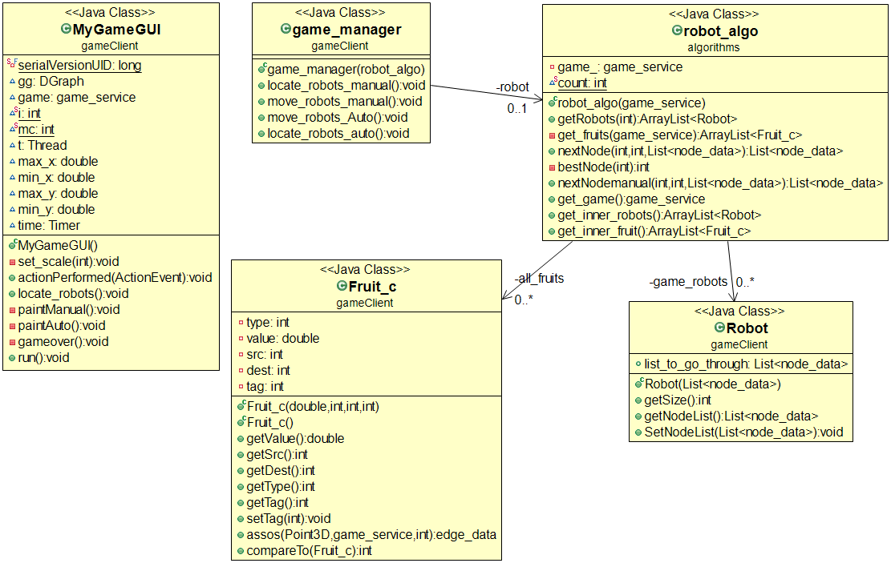
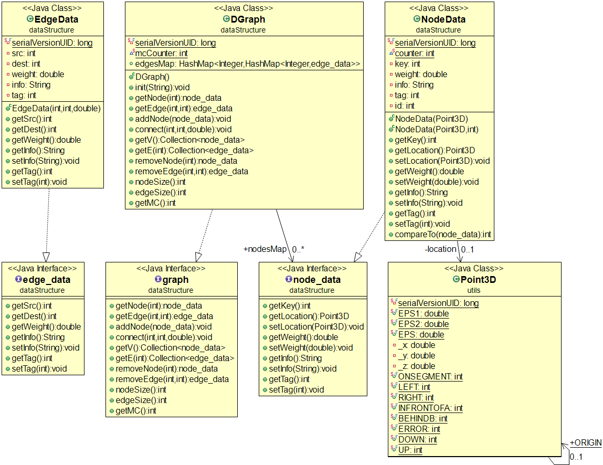

[](https://il.linkedin.com/in/gal-bar-576638173?trk=people-guest_profile-result-card_result-card_full-click)
[](https://www.linkedin.com/in/eden-reuveni/)


# The-Maze-Of-Waze-Navigation-Game

[](http://www.youtube.com/watch?v=cTmzMv8FwFY "Project")


#             Info
```
The-Maze-Of-Waze-Navigation-Game main goal is to collect as much fruits you can "eat", you can do it by two ways:
- Manual mode
- Auto mode
```

###      Manual Mode
```
In Manual mode first of all you place your robots on the nodes that you want, 
after that all you need to do is to decide which fruit you want to collect for each 
robot and so on untill the game is over.
```

###      Auto Mode
```
In Auto mode sit back on your chair and let us do our best effort using our fine algorithams
in order to collect as much fruit in our given time we guarantee to the best result we can do!
```

### Game - Diagram


### DataStructure - Diagram


